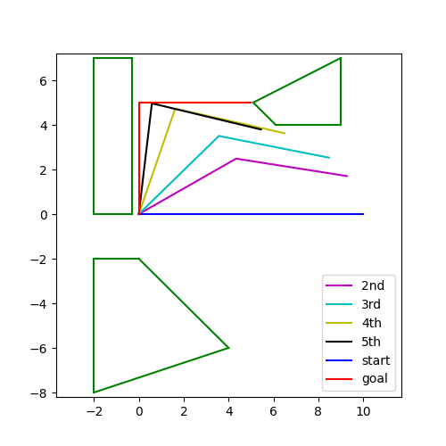

# Fast-Marching-Tree

Implementation of Fast Marching Tree (FMT). For comparisson sake, RRT and PRM are also implemented. Dependencies are gcc (clang), make, cmake, tkinter, python 3 and the matplotlicpp dependencies (see matplotlibcpp repo and matplotlib documentation).

## Run it

To interact with the implementation, first navigate to the build folder, and execute cmake then make. If not on mac delete the cache file when prompted, and rerun cmake.

> cd build
> cmake ..
> make

After the project is built, run it from the "main" subfolder. E.g. on mac:

> cd main  
> ./main

Main is controled using command line parameters. By default, FMT is run on a 2D example, and the result is shown in configuration space. The various possible flags are now listed.

For running tests, list one of the following (E is default): A, B, C, D, DT, E or F or equivalently point2D-A, point2D-B, point3D, arm2D, trivial2D, antro, hard. A and B correspond to dotlike robots in 2D space. C corresponds to dotlike robot in 3D space. D and DT correspond to a two-segment planar arm. E corresponds to a simplified antropomorphic arm in 3D space. F is a difficult planar planning example.

For setting algorithm of choice list one of the following: FMT, RRT, PRM or FMT*. The last two are nearly identical, except that FMT* has self-tuning radius. Radius is additionaly adjusted for weighed Euclidean metric.

The running mode can be either: normal (running testcase and plotting result on graph), time simulation (running algorithm 20 times and averaging runtime), parameter simulation (running algorithm with 27 varying parameter sets), energy simulation (plotting energy as function of number of samples / energy averaged over 3 iterations) or reachability simulation (plotting probability of successful connection as function of number of samples / over 10 iterations). These are set using respective flags:

-normal, -timesim, -paramsim, -energysim, -reachsim

The other flags are:

-seq enables sequential plotting of tree edges in RRT/FMT (works only for 2D cases) 
-file exports plot to file 
-path if this is on, path is shown in 3D, rather than the graph/tree; in 2D both are shown always 
-snapshot displays snapshots of robotic arm, moving in a 2D/3D workspace from start to finish (run with either D, DT or E)
-nobs turns off configuration space obstacle plotting (for examples with actual robotic arms)
eta=FLOAT sets the value of the tuning parameter eta to the value FLOAT

## Unit tests

Unit testing was done using gtest, and can be run from the build/unit folder. 

> cd unit
> ./unit

The unit tests focus on testing the geomertic functions.

## Using as library

Using the code as a library is pretty straightforward. To construct workspace/configuration space use geometry.h, which defines obstacles, implements collision detection and defines various simplified robotic arms. File planning.h defines the output information objects and defines graph nodes. The algorithms are implemented in fmt.h, rrt.h, prm.h. PRM supports multiple queries, unlike RRT and FMT*. All kinds of plotting is implemented in plot.h.

